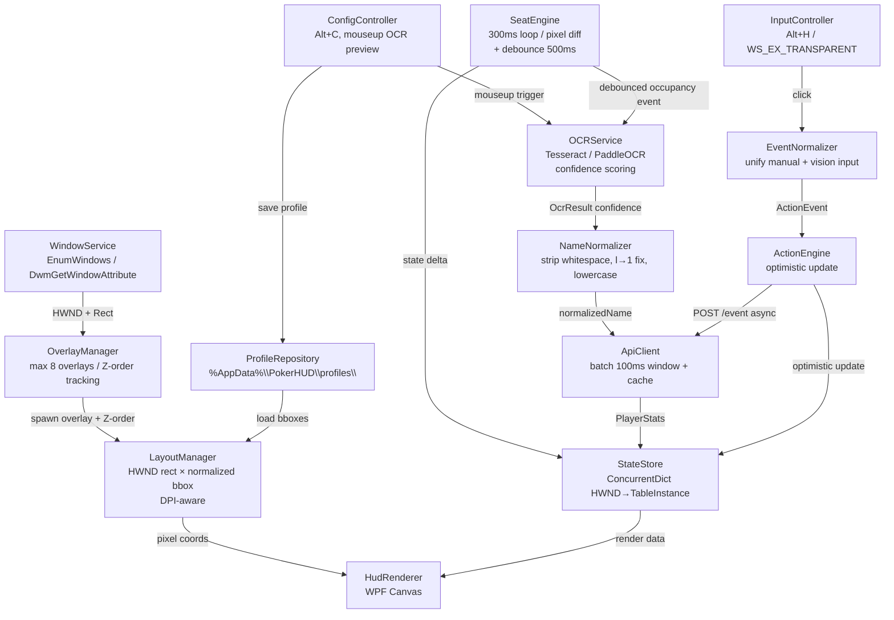

# Design: Adaptive Poker HUD (V2)

## Architecture Overview



## Module Responsibilities

| Module | Trách nhiệm |
|---|---|
| **WindowService** | `EnumWindows` tìm cửa sổ poker. Dùng `DwmGetWindowAttribute(DWMWA_EXTENDED_FRAME_BOUNDS)` để lấy rect chính xác (loại bỏ window chrome/border offset). |
| **OverlayManager** | Spawn WPF overlay (borderless, transparent). Từ chối overlay thứ 9. Subscribe `WinEventHook(EVENT_SYSTEM_FOREGROUND)` để track Z-order, tránh overlay đè sai window khi alt-tab. |
| **LayoutManager** | Nhận `NormalizedBBox` + `WindowRect` + DPI scale factor → tính `PixelRect`. Re-project khi `WM_WINDOWPOSCHANGED`. |
| **ConfigController** | Alt+C mở config mode. Render draggable handles. Trigger `OCRService` **sau mouseup** (không phải khi drag). Gọi `ProfileRepository.Save`. |
| **ProfileRepository** | Đọc/ghi JSON tại `%AppData%\PokerHUD\profiles\`. Schema migration theo `version` field. |
| **SeatEngine** | Task loop 300ms. Capture `seat_bbox` → pixel diff. **Debounce 500ms** trước khi emit event — tránh false trigger do animation/chip move. |
| **NameNormalizer** | Normalize raw OCR text: trim, lowercase, fix common OCR errors (`l`→`1`, `O`→`0`), strip special chars. Trước khi đưa vào fuzzy match. |
| **OCRService** | Interface `IOcrService`. Pre-process (grayscale, contrast x1.5, sharpen, scale x1.5). Trả về `OcrResult { Text, Confidence }`. |
| **ApiClient** | Gom tên mới trong **100ms window** → batch `POST /players/search`. Cache kết quả. `POST /event` async sau optimistic. Retry với exponential backoff. |
| **HudRenderer** | Bind `SeatState` → `HUDContainer`. Render `[VPIP/PFR/AF]` + `OcrErrorBadge` nếu `OcrFailed`. |
| **InputController** | Intercept `Alt+H` để toggle `WS_EX_TRANSPARENT`. Route click → `EventNormalizer`. |
| **EventNormalizer** | Unify input từ manual click và (future) vision detection → chuẩn hóa thành `ActionEvent` trước khi vào `ActionEngine`. |
| **ActionEngine** | Map `ActionEvent` → local `SeatState` increment (optimistic) → async `POST /event`. |
| **StateStore** | `ConcurrentDictionary<IntPtr, TableInstance>` (HWND làm key). Thread-safe. |

## Data Models

### Config Profile (JSON schema)
```json
{
  "version": 1,
  "layoutVersion": "1.0.0",
  "profileName": "PokerStars 6-Max",
  "siteName": "PokerStars",
  "tableType": "6-max",
  "createdAt": "2026-03-28T14:00:00Z",
  "updatedAt": "2026-03-28T14:00:00Z",
  "seats": [
    {
      "id": 1,
      "seat_bbox":  { "x": 0.45, "y": 0.12, "w": 0.10, "h": 0.08 },
      "name_bbox":  { "x": 0.43, "y": 0.10, "w": 0.14, "h": 0.05 },
      "hud_anchor": { "x": 0.45, "y": 0.20, "w": 0.10, "h": 0.06 }
    }
  ]
}
```

### State Store Models (C#)
```csharp
// Keyed by HWND (IntPtr) — unique per poker table window
public class TableInstance {
    public IntPtr   Hwnd            { get; set; }
    public string   WindowTitle     { get; set; }   // display only
    public string   ProfileName     { get; set; }
    public ConcurrentDictionary<int, SeatState> Seats { get; set; }
}

public class SeatState {
    // Identity
    public int      SeatIndex       { get; set; }
    public string   PlayerName      { get; set; }   // primary identity

    // Stability
    public string   StableId        { get; set; }   // hash(name + seat history)
    public string   LastValidName   { get; set; }   // locked when OCR fails
    public DateTime LastSeenTimestamp { get; set; }

    // Occupancy
    public Occupancy Status         { get; set; }   // EMPTY | OCCUPIED | UNKNOWN
    public bool     IsHeroSeat      { get; set; }   // future use

    // OCR state
    public bool     OcrFailed       { get; set; }
    public string   OcrRawText      { get; set; }   // raw output for debug
    public float    OcrConfidence   { get; set; }
    public int      OcrRetryCount   { get; set; }
    public bool     ManualOverride  { get; set; }   // user typed name manually

    // Stats
    public PlayerStats Stats        { get; set; }
}

public enum Occupancy { Empty, Occupied, Unknown }
```

### OCR Result
```csharp
public class OcrResult {
    public string Text        { get; set; }
    public float  Confidence  { get; set; }
    // confidence >= 0.6 → accept
    // 0.4 <= confidence < 0.6 → retry (max 2 lần)
    // confidence < 0.4 → mark OcrFailed = true, show badge
}
```

### Action Event
```csharp
public class ActionEvent {
    public string     PlayerId  { get; set; }
    public ActionType Type      { get; set; }
    public string     Street    { get; set; }   // preflop | flop | turn | river
    public string     Context   { get; set; }   // "vs1", "vs2", "multiway"
    public string     Source    { get; set; }   // "manual" | "vision"
}

public enum ActionType {
    CBet, FoldToCBet,
    ThreeBet, FoldToThreeBet,
    FourBet, FoldToFourBet,
    Call, Check, Raise
}
```

API payload:
```json
{
  "player_id": "abc123",
  "event_type": "cbet",
  "street": "flop",
  "context": "vs1",
  "source": "manual",
  "value": 1
}
```

## API / Interface Contracts

| Endpoint | Method | Payload | Response |
|---|---|---|---|
| `/players/search` | POST | `{ "names": ["PlayerA", "PlayerB"] }` | `[{ player_id, vpip, pfr, af, ... }]` |
| `/event` | POST | `{ player_id, event_type, street, context, source, value }` | `{ success: true }` |

- Auth: `Authorization: Bearer <token>`
- Batching: collect names trong 100ms window trước khi gửi `/players/search`
- Cache: invalidate sau 5 phút hoặc khi nhận event thay đổi stats

## Components (WPF)

### HUDContainer
```
HUDContainer
├── StatsText         [VPIP / PFR / AF]
├── ActionButtons
│   ├── +CB   (CBet)
│   ├── +F3B  (FoldToThreeBet)
│   ├── +3B   (ThreeBet)
│   └── +Call (Call)
├── NoteIndicator     (dot nếu có note)
└── OcrErrorBadge     "?" đỏ nếu OcrFailed
     └── onClick → inline ManualNameInput
```

### ManualNameInput (OCR failure UX)
- Click vào `OcrErrorBadge "?"` → hiện `TextBox` inline.
- Enter → lưu vào `SeatState.PlayerName`, set `ManualOverride = true`, query API.
- Esc → cancel.

### ConfigModeOverlay
- 3 draggable rects per seat: `seat_bbox` (xanh), `name_bbox` (vàng), `hud_anchor` (tím).
- Trigger OCR **sau MouseUp** → hiển thị kết quả + confidence % bên cạnh bbox.

## Key Design Decisions & Trade-offs

| # | Quyết định | Lý do |
|---|---|---|
| 1 | **HWND làm TableId** | Unique per window, stable. Title thay đổi liên tục trong game. |
| 2 | **Normalized bbox (0→1)** | Scale tự động — solve multi-resolution, resize, multi-site. |
| 3 | **OCR chỉ trigger sau mouseup** | Không spam OCR khi drag. Đơn giản, đủ dùng. |
| 4 | **Debounce 500ms** | Tránh false OCR trigger do seat animation/chip sliding. |
| 5 | **Confidence threshold 0.6/0.4** | Balance giữa retry cost và accuracy. Dưới 0.4 → force manual. |
| 6 | **Seat locking (LastValidName)** | Nếu OCR fail, giữ nguyên tên cũ — tránh HUD nhảy loạn. |
| 7 | **PlayerName is primary identity** | `SeatIndex` chỉ là vị trí render. Tránh bug khi player swap seat. |
| 8 | **EventNormalizer layer** | Unify manual click + future vision input → ActionEngine nhận cùng 1 format. |
| 9 | **DwmGetWindowAttribute** | Lấy rect chính xác bao gồm border offset và window chrome. |
| 10 | **WinEventHook foreground** | Giải quyết Z-order bug khi alt-tab — overlay không đè sai window. |
| 11 | **8-table hard cap** | Giữ 300ms loop ổn định. Warn user thay vì silent degrade. |
| 12 | **API batch 100ms window** | Tận dụng tối đa batch endpoint — tránh N+1 API calls khi nhiều seat join cùng lúc. |

## Robustness Rules

```
OCR flow:
  OcrResult.Confidence >= 0.6  → accept, update PlayerName
  OcrResult.Confidence  < 0.6  → retry (max 2 lần)
  OcrResult.Confidence  < 0.4  → OcrFailed = true, show badge, lock LastValidName

Seat locking:
  if OCR fail → keep SeatState.LastValidName (không clear)

Seat identity:
  PlayerName is primary key for stats lookup
  SeatIndex only used for HUD rendering position
```

## Performance Architecture

```
SeatEngine:    300ms polling loop (background Task)
               → pixel diff only (không decode full frame)
               → debounce 500ms sebelum trigger OCR

OCRService:    async Task.Run (không block UI thread)
               → chỉ khi occupancy thay đổi

ApiClient:     async HttpClient (singleton)
               → batch 100ms window
               → retry exponential backoff
               → cache 5 phút

UI thread:     chỉ nhận StateStore update → repaint
               → không có blocking call
```

## Future Extension: Vision Pipeline

```
[Frame Capture]
    ↓
[Vision Module]     detect cards, bets, actions
    ↓
[EventNormalizer]   ← unified input layer
    ↓
[ActionEngine]      same as manual click
```

👉 `EventNormalizer` là điểm mở rộng chính: vision và manual click đều vào cùng một pipeline.

## Security & Edge Cases

- `WS_EX_TRANSPARENT` toggle dùng lock tránh race condition nhiều table.
- `Per-Monitor DPI Aware V2`: khai báo trong `app.manifest`. Mọi tọa độ qua `DpiHelper.LogicalToPhysical()`.
- Overlay shutdown: `CancellationToken` per table — cleanup sạch khi poker window đóng.
- Config migration: kiểm tra `version` field khi load — nếu cũ hơn thì migrate schema trước khi dùng.
