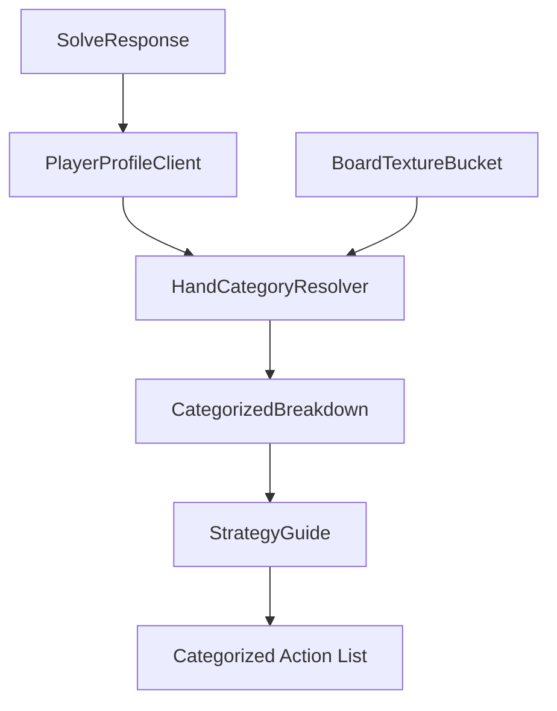

# Design: Categorized Action Breakdown

## Architecture Changes
- **Frontend**: Introduce `HandCategoryResolver` utility in `frontend/src/lib/analysis/`.
- **Frontend**: Update `PlayerProfileClient.tsx` to use the resolver during solve post-processing.
- **Frontend**: Update `StrategyGuide.tsx` props and rendering to support categorical breakdown.



## Data Models
### HandCategory
```typescript
type HandCategory = 'NUTS' | 'STRONG' | 'TOP_PAIR' | 'DRAW' | 'AIR';
```

### CategorizedBreakdown
Each category contains its aggregated frequencies and range weight.
```typescript
type CategorizedBreakdown = Record<HandCategory, {
    raise: number;   // Normalized % (0-100)
    call: number;    // Normalized % (0-100)
    fold: number;    // Normalized % (0-100)
    weight: number;  // Range frequency % (0-100)
    count: number;   // Number of hand combos
}>;
```

## HandCategoryResolver Logic
Heuristics based on `BoardTextureBucket` (`pairedStatus`, `suitedness`, `highCardTier`):
- **NUTS**: Top sets (pocket pairs on paired boards, strong broadway suited hands on monotone boards), top two pairs, or suited hands on `MONOTONE` boards.
- **STRONG**: Pocket pairs > `highCardTier`, or strong Broadway pairs (Kx on Q-high).
- **TOP_PAIR**: Ax on `ACE_HIGH` boards, Kx on `KING_HIGH` boards, etc.
- **DRAW**: Suited hands on `TWO_TONE` boards, or suited connectors.
- **AIR**: Default fallback for everything else.

### Determinism & Rules
1. **Deterministic**: Classification must be 100% deterministic based on board and hand. No random sampling.
2. **Exclusivity**: Resolver must always return exactly one category (priority: NUTS > STRONG > TOP_PAIR > DRAW > AIR).
3. **Normalization**: After aggregation, the `raise/call/fold` values within each category MUST be normalized to sum to 100%.

## Component Changes
### StrategyGuide
- **Prop Update**: `aiActionBreakdown` changes to `CategorizedBreakdown`.
- **UI Update**: 
    - Render a list of categories. 
    - Use `weight` to drive the Pie Chart (Range Composition).
    - Use `raise/call/fold` for the action bars/text within each category.

## Implementation Details
1. **Utility**: Create `frontend/src/lib/analysis/HandCategoryResolver.ts`.
2. **Integration**: Update `PlayerProfileClient.tsx`:
   - Group resolve results.
   - Sum weights per (category, action).
   - Normalize actions within each category bucket.
   - Calculate total range weight per category.
3. **View**: Modify `StrategyGuide.tsx` to display category slices.
