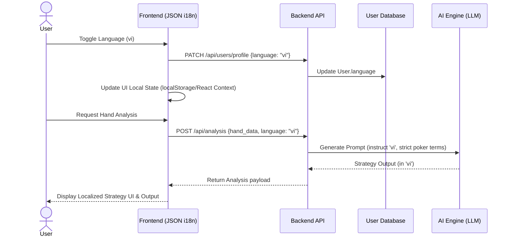

# Feature: Multilingual Support - Design

## Architecture Changes



* **Frontend:**
  * Add a Language selector in the Settings panel.
  * Implement a lightweight i18n system using simple JSON files (`en.json`, `vi.json`) wrapped in a React Context instead of adding heavy external frameworks.
  * Store language preference locally via `localStorage` for guests, and in the database profile for authenticated users.
* **Backend:**
  * Update User database model to include a `language` field (`en` | `vi`).
  * Include user `language` preference in API responses and persist it when updated.
* **AI Engine:**
  * Coordinate the transmission of the `language` field to the OCR/AI engine workflow.
  * Inject language override instructions into the LLM system prompts (e.g., `Respond strictly in {language}, but retain standard Poker acronyms in English`).

## Data Models (Backend)
```prisma
// Example Schema Additions
model User {
  id       String
  email    String
  language String @default("en") // "en" | "vi"
}
```

## API & Interfaces

### Update User Language
```http
PATCH /api/users/profile
{
  "language": "vi"
}
```
Response:
```json
{
  "success": true,
  "language": "vi"
}
```

### Include in AI Request
```json
{
  "language": "vi",
  "hand_data": { ... }
}
```

## Components
* **Settings Panel Dropdown:**
  * English 🇺🇸
  * Vietnamese 🇻🇳

## Design Decisions
* Fallback to English (`en`) for any missing keys in the Vietnamese (`vi`) translation pack.
* Technical poker terms (e.g., BTN, XR, AQo) are specifically instructed to remain in English to avoid unnatural translations in the AI output context.

## Security & Performance Considerations
* Key-based translations should not bloat the first paint; consider code splitting for language JSON chunks if they grow large.
* Input validation on the language code (`en`, `vi`) must take place at the backend to prevent arbitrary injections into the database and prompt templates.
