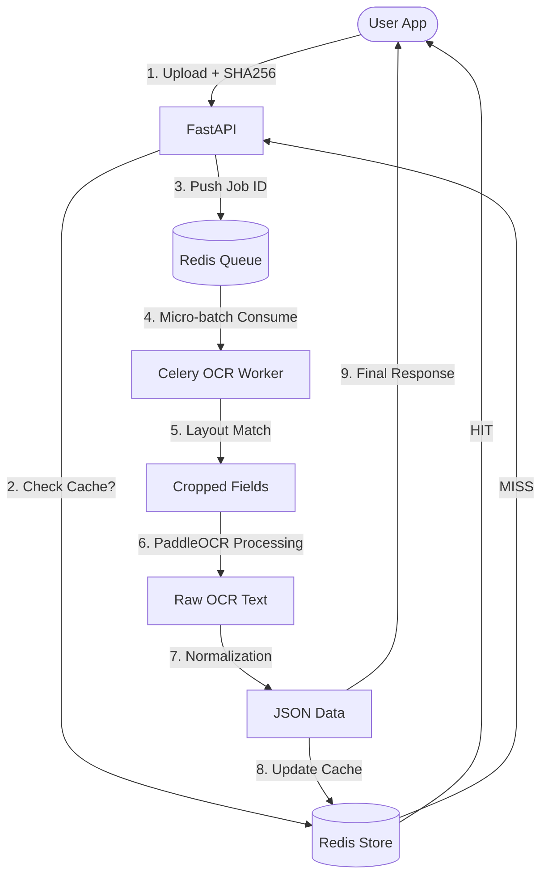

# 🚀 DESIGN SPEC: OCR Service (FastAPI + PaddleOCR + Celery)

## 🏗️ High-Level Architecture

The service will be independent of the Node.js/Prisma main backend. It acts as a specialized **computation node**.



## 🔌 API & Integration Rules

### 1. SHA256 Dedup
Before pushing a task to Celery, the API calculates the SHA256 hash of the image content. If the hash exists in Redis with a status of `done` or `processing`, the API returns the existing `job_id`.

### 2. Layout Detection (Fast/CPU Friendly)
We utilize **OpenCV Template Matching** with a set of low-res UI anchor templates (e.g., "Pot:" label, "Seat" buttons). 
1. Identify poker client profile.
2. Select crop coordinates based on detection anchor (relative mapping).
3. If no anchor matches, proceed to **Full-Image Vision Mode** as fallback.

### 3. Micro-batching (Worker Strategy)
The worker will utilize a local buffer or Celery's built-in batching to process 2–8 images per `PaddleOCR.ocr()` call. This significantly reduces model latency overhead for sequential requests.

### 5. Hand Data Extraction Engine (Specialized Sub-module)
See detailed spec: [hand-ocr-spec.md](./hand-ocr-spec.md)

*   **Board Recognition**: Uses **Template Matching** (Rank 1-K, Suit D/C/H/S). NOT pure OCR.
*   **Action Parsing**: Fuzzy matching for keywords ("Theo" -> **CALL**, "Tố" -> **RAISE**).
*   **Normalization Rules**:
    *   `8B`, `B8`, `88` (at end of line) → `BB`.
    *   Fuzzy numeric parsing (handling OCR comma/period confusion).
*   **Validation Layer**: Cross-checks `ExtractedPot` against the sum of individual player `Actions`.

## 🧠 OCR Strategy

### 1. Initialization
The `OCRWorker` will instantiate `PaddleOCR(use_gpu=False, lang='en')` at the module level or inside the Celery worker `worker_init` signal.

### 2. Preprocessing (OpenCV)
1.  **Resize**: If `width < 640px`, upscale by **1.5x** with cubic interpolation for better font detection.
2.  **Color**: Convert to **GRAY**.
3.  **Thresholding**: Apply **Otsu's Threshold** or fixed binary if the background is uniform (poker felt is usually dark).

### 3. Region-Based Cropping
Instead of one massive OCR run, we define **Region Detectors**:
*   **Pot Detector**: Top-center area crop.
*   **Player Detector**: Radius-based search around middle of screen (where players sit).
*   **Log Detector**: Bottom-left/right corner.

Each crop is processed separately and the text is aggregated.

## 🧱 Dependency Management (`requirements.txt`)

```text
fastapi==0.110.0
uvicorn==0.27.1
paddlepaddle==2.6.1
paddleocr==2.7.3
opencv-python==4.9.0.80
numpy==1.26.4
Pillow==10.2.0
celery==5.3.6
redis==5.0.1
python-multipart==0.0.9
```

## 🐳 Dockerization

### `Dockerfile`
A slim Python 3.10 image.
*   Installs `libgl1-mesa-glx` and `libglib2.0-0` (required for OpenCV in Linux).
*   Configures environment for the `worker` or `api` command based on `CMD`.

### `docker-compose.yml`
*   `ocr-api`: Port 8000
*   `ocr-worker`: No exposed ports
*   `redis`: Port 6379

## ⚡ Performance & Resource Management

*   **Memory**: Workers will limit concurrent OCR tasks to avoid RAM spikes.
*   **CPU**: PaddleOCR is CPU-heavy; we will pin worker concurrency to the number of available cores.
*   **Timeout**: If processing exceeds 10s, return `status: timeout`.

## 🔒 Security
*   Validate file magic headers to ensure it is truly an image.
*   Rate limiting at the FastAPI level.
