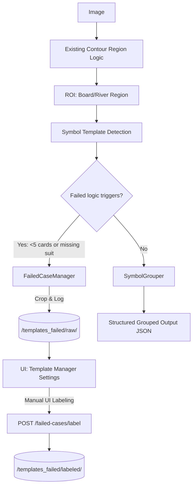

# 🏗️ DESIGN SPEC: Symbol-Based Card Detection with Failed Case Sync

## 🚀 Architecture Changes
1. **Remove Old Card Detection Pipeline**: Completely eliminate the heuristic-based full-card auto-learning logic that depended on contour card extraction.
2. **Implement Symbol Template Detection**: Instead of extracting card contours, use raw OpenCV template matching (or equivalent) directly on the grouped Board/River ROI using predefined ranks and suits template collections.
3. **Add Failed-Case Capture System**: Intercept cases where expected board states are not met (e.g., `< 5` cards on board or missing suits) and extract the region to a new storage system `/templates_failed/raw/`.
4. **API Integration for Corrections**: Introduce server-side logic to serve failed cases to the frontend and an endpoint to accept manual labels.
5. **Data Flow**:
   


## 📊 Data Models

### 1. Symbol Detection Output
```json
[
  { "type": "rank", "value": "4", "x": 500, "y": 320 },
  { "type": "suit", "value": "C", "x": 510, "y": 322 }
]
```

### 2. Grouped Card Output
```json
{
  "board": [
    { "card": "AH", "x": 480, "y": 320 }
  ],
  "river": [
    { "card": "4C", "x": 505, "y": 321 }
  ]
}
```

### 3. Failed Case Management API Request
```json
{
  "image": "base64_or_path_to_region.png",
  "region": "river",
  "detected": ["4?", "?C"] // Partial detections
}
```

### 4. Failed Case Labeling API Request
```json
{
  "id": "failed_crop_1234.png",
  "labels": ["4C", "8S"]
}
```

## 🔌 API & Interfaces

- `POST /failed-cases`: (Internal/OCR Service) Records a failed region and partial detections into the debug logging system.
- `GET /failed-cases`: (UI Client) Fetches a list of unlabelled raw crops from `/templates_failed/raw/`.
- `POST /failed-cases/label`: (UI Client) Submits corrected labels to the OCR Service via UI interaction, moving the crop to `/templates_failed/labeled/`.

## 🧩 Components

1. **CardSymbolDetector** (Backend)
   - Handles the load and processing of `/templates/ranks/` and `/templates/suits/`.
   - Performs matching algorithms.
2. **SymbolGrouper** (Backend)
   - Groups a rank and suit if their coordinates meet rules: `dx < 15, dy < 10`.
   - Sorts the Board horizontally (`X`) and River vertically (`Y`).
3. **FailedCaseManager** (Backend)
   - Determines trigger criteria (`len(board) < 5` or `missing values/suits`).
   - Crops missing/suspicious regions, logs them.
4. **Debug Image Logger** (Backend)
   - Optionally writes intermediate bounding box coordinates or cropped processing slices to disk (`/debug_crops/`) for developer introspection.
5. **Template Manager in Setting (Frontend)**
   - Display a thumbnail to users.
   - Text inputs to apply final labels ("4C").
   - Action buttons to "Submit Correction".

## 🛡️ Security & Performance
- **Performance**: Symbol detection must not significantly slow down the bounding box parsing or existing region splitting.
- **Security**: The failed cases images potentially contain sensitive hand logs; however, being cropped to region ROIs, data leakage is minimized. Ensure the API endpoint does not expose raw table data without auth.
- **Storage**: Set size limits for `/templates_failed/` to prevent explosive growth.
