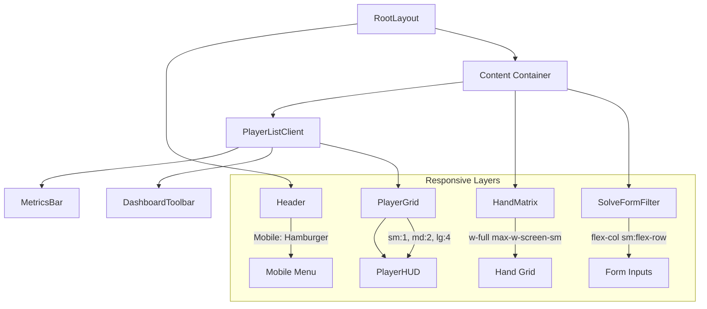

# Design: UI Responsiveness & Mobile Optimization

## Architecture Changes
No core architectural changes are required. The project already uses **Tailwind CSS**, which is perfectly suited for mobile-first responsive design. The changes will primarily focus on:
- **Layout Components**: Adjusting `RootLayout`, `Header`, and `Sidebar` for mobile navigation.
- **Dashboard Components**: Updating `PlayerListClient`, `MetricsBar`, and `DashboardToolbar` with responsive grid and flex classes.
- **Solver Components**: Updating `HandMatrix` and `SolveFormFilter` to handle small viewports.

## UI Design Decisions

### 1. Unified Responsive Container
Use a standard max-width container with padding that scales:
- **Mobile**: `px-4`
- **Desktop**: `px-8 max-w-7xl`

### 2. Hand Matrix Scaling
Instead of a fixed size (`max-w-3xl aspect-square`), the `HandMatrix` should:
- Use `w-full` on mobile.
- Use `aspect-square` correctly so it remains a perfect grid.
- Adjust font sizes of hand labels (e.g., `AA`, `AKs`) based on screen width using CSS `clamp()` or Tailwind responsive text classes (`text-[10px] md:text-sm`).

### 3. Solve Form Filter Stacking
Currently, the filter row uses `flex-wrap`. We will refine this:
- **Mobile**: Single-column vertical stack for all selects and inputs.
- **Tablet+**: 2-column or 3-column grid to maintain compactness.
- **Action Button**: Should be full width on mobile for better thumb reach.

### 4. PlayerHUD Cards
The player grid will use a standard responsive grid:
- **Mobile (< 640px)**: `grid-cols-1`
- **Small Tablet (640px - 768px)**: `grid-cols-2`
- **Desktop (> 1024px)**: `grid-cols-3`
- **Large Desktop (> 1280px)**: `grid-cols-4`

## Component Updates

### `PlayerListClient.tsx`
- **Layout**: Adjust padding (`p-4` on mobile vs `p-8` on desktop).
- **Infinite Scroll Sentinel**: Ensure it's reachable and doesn't cause layout jumps.

### `HandMatrix.tsx` & `HandCell.tsx`
- **Sizing**: Remove fixed widths and use `w-full`.
- **Text**: Use responsive text sizes so `72o` remains visible but doesn't overflow small cells.
- **Touch**: Ensure hover states work correctly or provide a clear "Tap to view detail" interaction for mobile which currently relies on `title` attribute (native tooltips).

### `Header.tsx`
- **Logo/Title**: Shrink or hide subtitle on mobile.
- **Action Buttons**: Group into a menu or stack vertically if needed.

## Performance Considerations
- **CSS-Only**: Prioritize CSS media queries over JS-based window resizing logic to prevent flickering.
- **Tap Targets**: Ensure all buttons and interactive elements meet the human interface guidelines (minimum 44x44px).
